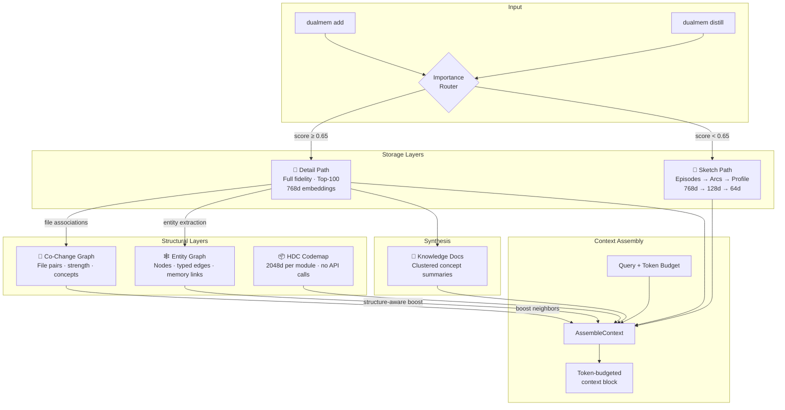

# geoffreyengram

Cognitive memory engine for AI agents. Gives coding tools (Claude Code, Cursor, etc.) cross-session memory with token-budget-aware retrieval, learned file relationships, and structural code search.

Pure Go, SQLite (no CGO), single binary.

## Architecture



**Dual-path routing**: Memories are scored at insert time (no LLM calls). High-importance memories (decisions, warnings) stay at full fidelity in the Detail Path. Everything else is compressed into a hierarchical sketch: episodes (30-day retention) → narrative arcs (90-day, 128d projection) → user profile (64d projection).

**Context assembly**: Given a query and token budget, `AssembleContext` packs the most relevant context in priority order: structural diff → checkpoints → code map (HDC-ranked, co-change-expanded) → knowledge docs → profile → arcs → detail memories → episodes. Task-aware: auto-detects intent (debug/continue/feature/explore) and adjusts memory type weights.

## Quickstart

```bash
go install github.com/goblincore/geoffreyengram/cmd/dualmem@latest
export GEMINI_API_KEY=your-key  # add to ~/.zshrc

dualmem add --text "Auth uses JWT, not sessions" --type decision
dualmem add --text "Don't touch rateLimiter cleanup()" --type warning --salience 0.9 --files "rate_limiter.go"
dualmem search "authentication" --limit 5
dualmem search-code "authentication middleware"       # HDC-powered, no API calls
dualmem context "fix the auth bug" --budget 3000      # token-budgeted context
```

For Claude Code integration, copy [`docs/example-claude-md.md`](docs/example-claude-md.md) into your `~/.claude/CLAUDE.md`.

## Features

### Memory types and routing

Memories are classified into sectors and scored by importance. Typed memories (`--type warning`, `--type decision`) are biased toward the Detail Path:

```bash
dualmem add --type warning --text "Don't touch rateLimiter cleanup()" --files "rate_limiter.go" --salience 0.9
dualmem add --type decision --text "Rejected Postgres, chose SQLite" --files "store_sqlite.go"
dualmem add --type continuity --text "Done: JWT. Remaining: refresh tokens" --files "auth.go,jwt.go"
```

Context assembly prioritizes: warnings first, then decisions, then general memories. Intent-aware weighting adjusts per query — debugging boosts warnings (2x), resuming boosts continuity (2x).

### Checkpoints — structured session handoffs

```bash
dualmem checkpoint --task "auth refactor" --status in_progress \
  --files "auth.go,middleware.go" \
  --done "JWT validation,middleware" --remaining "refresh tokens,logout"
dualmem checkpoint --list
```

### Co-change graph — learned file relationships

When a memory mentions multiple files, DualMem automatically builds co-change edges between all file pairs. Over time, this creates a learned map of which files change together.

```bash
dualmem cochange auth.go                      # files that co-change with auth.go
dualmem cochange auth.go --min-strength 2.0   # only strong relationships
dualmem cochange --decay                      # apply 90-day half-life decay
```

**Context assembly integration**: File hints from checkpoints and memories are expanded through co-change neighbors. Working on `auth.go`? The codemap will also highlight `middleware.go` and `jwt.go` if they historically co-change — even if their code structure (HDC vectors) is dissimilar.

Edges include concept labels (entity names that explain *why* files co-change), populated automatically during `dualmem synthesize`.

### Entity graph — structure-aware retrieval

Entities extracted from memories are stored in a knowledge graph. Search applies **structure-aware** graph traversal — direct entity matches get full boost, expanded neighbors get reduced boost scaled by edge type:

| Edge type | Multiplier | Meaning |
|-----------|-----------|---------|
| `depends_on` | 1.0 | Strong structural relationship |
| `implements` | 0.9 | Strong behavioral relationship |
| `modifies` | 0.8 | Moderate change relationship |
| `uses` | 0.7 | Moderate usage relationship |
| `relates` | 0.5 | Weak association |

```bash
dualmem entities                          # graph stats
dualmem entities search "SQLite"          # find entities by name
dualmem entities show "store_sqlite.go"   # entity + relationships
```

### Knowledge documents — synthesized context

`dualmem synthesize` clusters related memories and produces coherent concept documents. These appear in context output before individual memories, saving tokens:

```bash
dualmem synthesize --dry-run   # preview clusters
dualmem synthesize             # synthesize knowledge docs
dualmem docs                   # list docs
dualmem docs show <topic>      # read a doc
```

### HDC-powered code search

Find relevant code modules by natural language — uses hyperdimensional computing (2048-dim vectors from path, symbols, language, identifiers), no API calls, ~55us/query:

```bash
dualmem search-code "authentication middleware"
dualmem search-code "database connection pooling" --limit 5
```

### Session distillation — ambient memory capture

Automatically extract memories from session transcripts at session end:

```bash
dualmem distill              # auto-detect latest Claude Code session
dualmem distill --dry-run    # preview extracted facts
dualmem distill --auto       # idempotent (for hooks)
```

### File-scoped recall

Inject relevant memories when Claude opens a file — warnings about `rate_limiter.go` surface even if the session task is "refactor error handling":

```bash
dualmem file-context rate_limiter.go   # memories for a specific file
dualmem file-index                     # regenerate file index for hook
```

### Context quality ratings & adaptive re-ranker

Measure whether assembled context is actually useful. The consuming agent (e.g., Claude) rates each context item at two moments — prospectively when context loads, and retrospectively at session end.

```bash
dualmem context "auth refactor" --budget 3000
# → outputs context + snapshot ID (e.g. snap_17752...)

# Agent rates items after reading context (early) or at session end (late):
dualmem rate --snapshot snap_17752... --phase early --ratings '{"mem_abc": 2, "mem_def": 0}'
dualmem rate --snapshot snap_17752... --phase late  --ratings '{"mem_abc": 2, "mem_ghi": 1}'

# Session-level rating:
dualmem rate --session --score 4 --explanation "warnings were helpful, codemap too broad"

# View accumulated stats:
dualmem stats
```

Once 50+ ratings accumulate, train a learned re-ranker that improves retrieval ordering:

```bash
dualmem train   # fits logistic regression from ratings → stores weights
```

The re-ranker adjusts candidate memory ordering during `AssembleContext` using 10 features (cosine similarity, importance, salience, memory type, file overlap, age, etc.). Late-phase ratings are weighted 2x over early-phase in training. Safety rails: coefficients bounded to [-5, 5], re-ranker only adjusts ordering (never filters), `--no-rerank` flag for comparison.

### Seed — cold-start context

Pre-seed context for new projects by analyzing codebase structure:

```bash
dualmem seed --dry-run   # preview clusters
dualmem seed             # generate seed memories
```

## CLI Reference

```bash
# Memory
dualmem add --text "..." --type decision --salience 0.9 --files "a.go,b.go"
dualmem search "query" --limit 5
dualmem search "LC-1663"                                # identifier pre-filter

# Code search (HDC-powered, no API calls)
dualmem search-code "authentication middleware"

# Context assembly
dualmem context "auth system" --budget 3000
dualmem context "fix the bug" --intent debug

# Session management
dualmem checkpoint --task "auth refactor" --status in_progress --files "auth.go" --done "JWT" --remaining "refresh,logout"
dualmem checkpoint --list
dualmem map                                             # codebase structure map
dualmem diff                                            # changes since last session

# Seed and distillation
dualmem seed [--dry-run] [--force]
dualmem distill [--dry-run] [--auto] [--file path]

# File-scoped recall
dualmem file-context rate_limiter.go
dualmem file-index

# Entity graph
dualmem entities [stats|search|show|top]

# Co-change graph
dualmem cochange <file> [--min-strength N] [--decay]

# Knowledge docs
dualmem docs [list|show|delete|export]
dualmem synthesize [--dry-run] [--force] [--all]

# Context quality
dualmem rate --snapshot <id> --phase late --ratings '{"mem_id": 2}'
dualmem rate --session --score 4 --explanation "..."
dualmem train                                           # fit re-ranker from ratings
dualmem stats                                           # quality metrics + trends

# Maintenance
dualmem promote --id <id> [--type warning --salience 0.9]
dualmem demote --id <id>
dualmem gc [--dry-run --verbose]
dualmem profile
dualmem status
```

## Claude Code Integration

Copy [`docs/example-claude-md.md`](docs/example-claude-md.md) into your `~/.claude/CLAUDE.md`. It teaches the agent to:
- Load context at session start (`dualmem context`)
- Save decisions, warnings, and checkpoints during work
- Search memory before exploring (`dualmem search`)
- Use HDC code search (`dualmem search-code`)
- Always include `--files` to build the co-change graph

**Hooks** (add to `.claude/settings.json`):
- **Stop hook**: `dualmem distill --auto` — ambient memory capture at session end
- **PreToolUse Read hook**: `dualmem file-context` — inject file-scoped memories when Claude opens a file

See [`docs/example-claude-md.md`](docs/example-claude-md.md) for the full template.

## Engram — Character Memory for NPCs

Also includes **Engram**, a character memory system for NPCs, companions, and chatbots. Memories are classified into cognitive sectors (episodic, semantic, procedural, emotional) with natural exponential decay, entity graph associations, and reflective synthesis.

- Composite scoring: `(similarity*0.6 + salience*0.2 + recency*0.1 + linkWeight*0.1) * sectorWeight`
- Waypoint entity graph: mentioning a song surfaces the person you heard it with
- Multimodal: text, images, audio in same vector space (Gemini Embedding 2)
- Reflective synthesis: `Reflect()` creates meta-memories between conversations
- MCP server: `engram-mcp` with tools for remember, recall, reflect

```go
import engram "github.com/goblincore/geoffreyengram"

mem, _ := engram.Init(engram.Config{
    DBPath:       "./data/memory.db",
    GeminiAPIKey: os.Getenv("GEMINI_API_KEY"),
})
defer mem.Close()

mem.Add("I just got back from Berlin!", "That's amazing!", "lily:player123")
results := mem.Search("travel", "lily:player123", 5, nil)
```

## Project Structure

```
geoffreyengram/
├── engram.go              # Engram core (Init, Search, Add, Reflect)
├── dualmem/               # DualMem agent memory engine
│   ├── dualmem.go         # Engine (Add, DualSearch, AssembleContext, Synthesize)
│   ├── types.go           # Config, Store interface, Intent, all data types
│   ├── detail.go          # Detail Path (importance scoring, capacity management)
│   ├── sketch.go          # Sketch Path (episodes, arcs, profiles)
│   ├── pipeline.go        # Background compression workers
│   ├── cochange.go        # Co-change graph (builder, query, entity enrichment)
│   ├── codemap.go         # Codebase scanner, HDC search, co-change-aware ranking
│   ├── hdc.go             # HDC encoder (2048-dim, 4-layer)
│   ├── parse_treesitter.go # Tree-sitter (TypeScript, Python, Rust)
│   ├── diff.go            # Git-based structural diffs, stale memory detection
│   ├── knowledge.go       # Knowledge doc synthesis
│   ├── distill.go         # Session transcript distillation
│   ├── rating.go          # Context quality ratings, snapshots, training rows
│   ├── reranker.go        # Learned re-ranker (logistic regression from ratings)
│   ├── store_sqlite.go    # SQLite backend (migrations v1-v9)
│   └── project.go         # Random projection, cosine similarity
├── cmd/
│   ├── dualmem/           # CLI tool
│   ├── dualmem-mcp/       # MCP server
│   └── engram-mcp/        # Engram MCP server
└── examples/
    ├── chat/              # Local REPL with Ollama
    ├── comparison/        # Memory mode comparison + LLM judge
    └── dualmem-bench/     # LLM-as-judge benchmark (9 tasks: QA, codegen, triage)
```

## Status

Extracted from [Club Mutant](https://github.com/goblincore/club-mutant) (production NPC memory) and extended for coding agent use. 260+ tests passing.

## License

MIT
